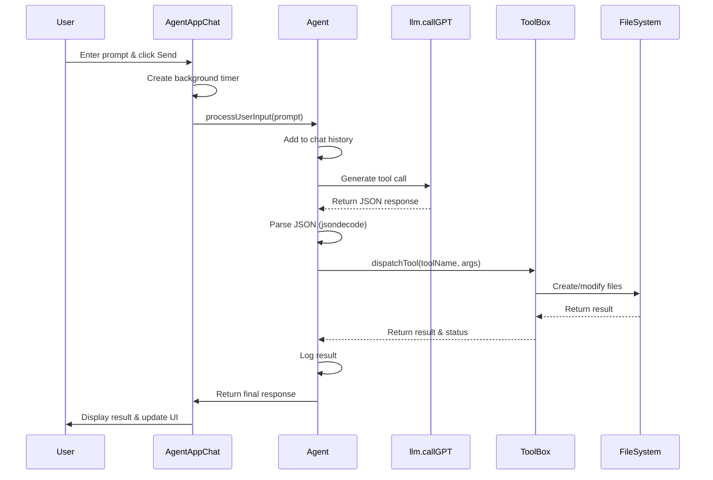
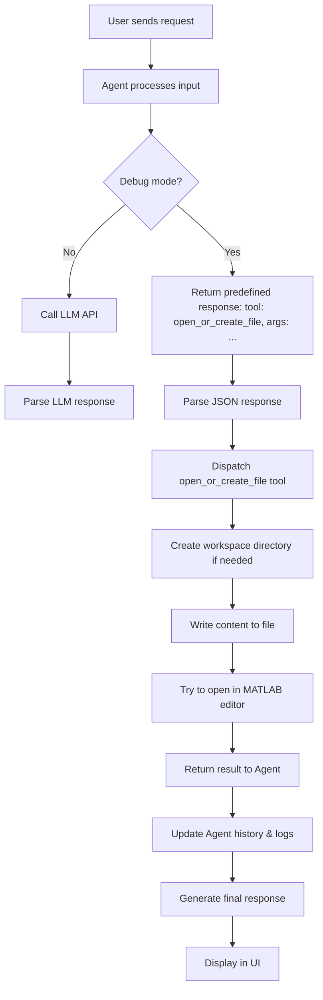
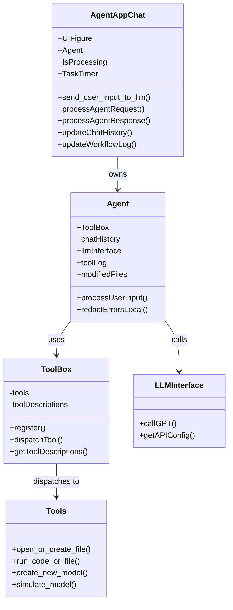
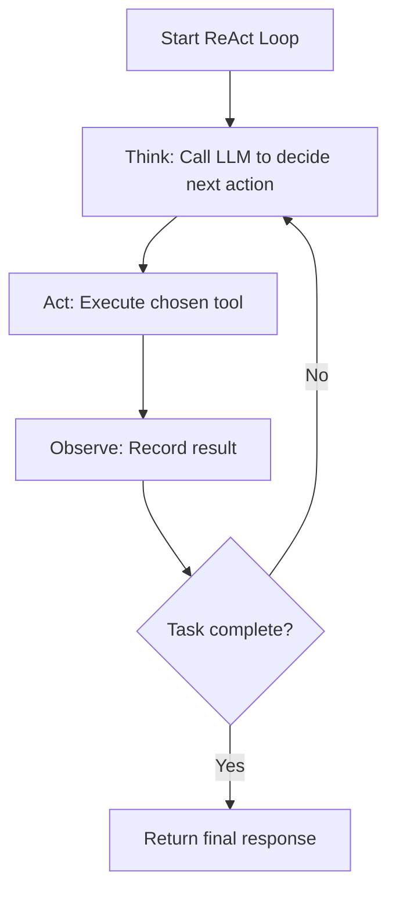
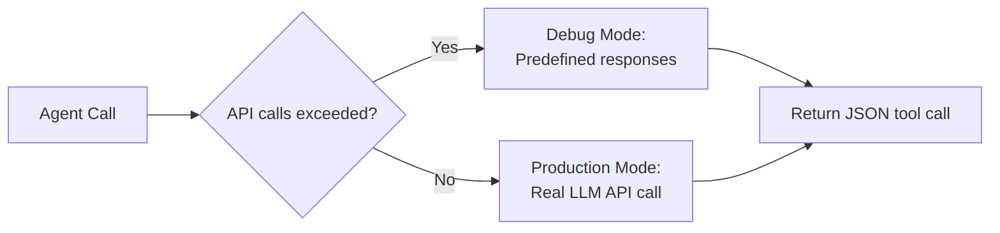
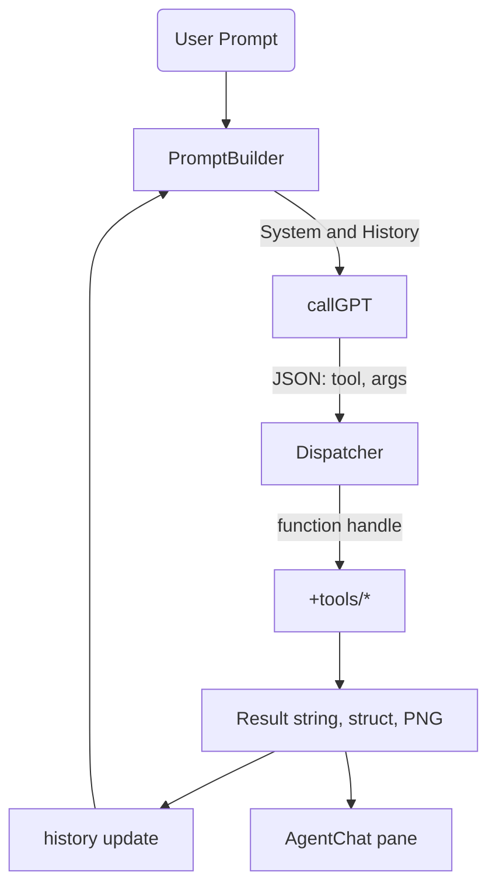

# Orion Agent 

## Description

Orion Agent is an in-process AI companion that converts natural–language requests into MATLAB® scripts and Simulink® models, executes them, inspects results, and iterates—without any GUI-level mouse automation.

It achieves this by exposing a curated set of programmatic "tools" (functions) to a Large-Language Model (LLM). A lightweight ReAct loop stored in memory decides which tool to call next, receives structured feedback (block handles, simulation outputs, error objects), and plans subsequent actions until the user's goal is met.

Build Orion Agent, an in-process AI assistant that lives inside a licensed MATLAB + Simulink session, interprets natural-language tasks through a large-language model (LLM), and executes them programmatically by calling documented MathWorks APIs. Orion never drives the GUI with mouse clicks; it manipulates models through add_block, add_line, set_param, sim, the MATLAB Desktop Editor API, and other stable interfaces.

---

## Project Layout

```
Orion-Agent/
│
├── +agent/                  % core decision loop
│   ├── Agent.m              % ReAct controller; owns chat history
│   ├── ToolBox.m            % registers callable tools
│   └── utils/
│       ├── redactErrors.m   % strips stack traces before LLM sees them
│       └── safeRedactErrors.m  % enhanced error redaction
│
├── +tools/                  % thin wrappers around MATLAB/Simulink APIs
│   ├── +general/
│   │   └── doc_search.m     % find_system / web search of MathWorks help
│   ├── +matlab/
│   │   ├── check_code_lint.m     % checks code for errors and style issues
│   │   ├── commit_git_repo.m     % commits changes to git repository
│   │   ├── get_workspace_var.m   % retrieves value of workspace variable
│   │   ├── open_or_create_file.m % creates or opens a file in editor
│   │   ├── read_file_content.m   % reads contents of a file
│   │   ├── run_code_or_file.m    % evalc wrapper for arbitrary MATLAB code or runs file
│   │   ├── run_unit_tests.m      % executes unit tests
│   │   ├── set_workspace_var.m   % sets value of workspace variable
│   │   └── write_file_contents.m % writes content to a file
│   └── +simulink/
│       ├── auto_layout.m          % Simulink.BlockDiagram.arrangeSystem
│       ├── close_current_model.m  % closes the active Simulink model
│       ├── connect_block_ports.m  % add_line to connect model elements
│       ├── create_new_model.m     % new_system + open_system
│       ├── disconnect_block_ports.m % removes connections between blocks
│       ├── get_block_params.m     % retrieves parameters of blocks
│       ├── insert_library_block.m % add_block wrapper (makes name unique)
│       ├── open_existing_model.m  % opens an existing Simulink model
│       ├── remove_block.m         % removes blocks from model
│       ├── save_current_model.m   % saves the current model
│       ├── set_block_params.m     % sets parameters on blocks
│       └── simulate_model.m       % out = sim(mdl,'ReturnWorkspaceOutputs','on')
│
├── +llm/
│   ├── callGPT.m            % webwrite → OpenAI or local Llama
│   └── promptTemplates.m    % System & few-shot templates
│
├── app/
│   └── AgentAppChat.m          % Enhanced Chat interface for interacting with the agent
│
├── orion_workspace/
│   └── debug_hello.m        % simple test file
│
├── tests/
│   └── t_basic.m            % ensures each tool works on clean MATLAB
│
├── setup_paths.m            % adds necessary directories to MATLAB path
├── launch_agent.m           % script to start the Orion Agent
├── llm_settings.m           % configuration for LLM connection settings
├── README.md                % project overview and documentation
└── set_api_key.bat          % Windows batch file to set API key environment variable
```

---

## UI Implementation Details

The Orion Agent application UI has been completely redesigned with an improved interface that separates the chat interaction from the agent workflow visualization. The new implementation in `app/AgentAppChat.m` replaces the older `AgentChatOld.m` with several key enhancements.

### Backend Logic Implementation

The following key components were added to the AgentAppChat.m file to implement the backend logic:

1. **Properties for Agent Functionality**
   - `Agent`: Reference to the agent.Agent instance
   - `CurrentModelName`: Tracks the active Simulink model
   - `IsProcessing`: Flag to indicate when the agent is busy
   - `TaskTimer`: Timer object for asynchronous processing
   - `CurrentSnapshot`: Stores model snapshot data

2. **Utility Methods**
   - `updateChatHistory()`: Updates the chat history with user/assistant messages
   - `updateWorkflowLog()`: Adds timestamped entries to the workflow log
   - `setAgentStatus()`: Updates status indicators with color-coded feedback
   - `updateModelPreview()`: Captures and displays Simulink model snapshots
   - `processAgentResponse()`: Parses agent responses and updates the UI
   - `base64decode()`: Decodes base64 image data for model snapshots

3. **Event Handlers**
   - `send_user_input_to_llm()`: Processes user input and sends to agent
   - `clear_agent_thought_process()`: Clears the workflow log panel
   - `stopExecution()`: Cancels ongoing agent operations
   - `processAgentRequest()`: Background processing using timer
   - `finishProcessing()`: Cleanup after agent task completion
   - `handleTimerError()`: Error handling for background tasks

4. **Initialization & Cleanup**
   - Constructor initializes agent and sets up welcome message
   - `onAppClose()`: Handles cleanup when app is closed
   - Resource management for timers and open models

### UI Workflow

The implemented backend logic supports the following workflow:

1. User enters text in the input area and clicks "Send"
2. The input is displayed in the chat history and sent to the agent
3. Agent status changes to "Processing" with yellow indicator
4. Agent processes the request in a background timer to keep UI responsive
5. Tool execution is logged in the Agent Workflow panel with timestamps
6. Any model snapshots are displayed in the preview area
7. When complete, status changes to "Ready" with green indicator
8. If errors occur, they're displayed in both chat and workflow logs with red indicator

### Enhanced Features

The implemented backend logic adds several new capabilities:

1. **Asynchronous Processing**: Uses timer objects to keep the UI responsive during long-running operations
2. **Visual Status Feedback**: Color-coded lamp indicator shows agent status (green=ready, yellow=processing, red=error)
3. **Detailed Workflow Logging**: Timestamped logs of all tool executions and operations
4. **Operation Cancellation**: Stop button allows cancelling in-progress operations
5. **Resource Management**: Proper cleanup of resources when operations are stopped or app is closed
6. **Error Visualization**: Clear error indicators in both chat and workflow panels

### Separation of Concerns

The implementation follows a clean separation of concerns:

- **UI Components**: Handled by createComponents() (layout)
- **Agent Logic**: Implemented through the Agent class
- **UI Updates**: Managed by utility methods
- **Event Handling**: Connected to UI buttons through callback functions
- **Resource Management**: Proper initialization and cleanup lifecycle

These enhancements significantly improve the user experience by providing better visibility into the agent's operations and more responsive interaction.

---

## Detailed Agent Workflow

### Complete Process Flow

The following section provides a detailed step-by-step explanation of how Orion Agent processes user requests, from input to completion.

When a user enters a prompt like "Create a hello world script that prints 1 to 10", here's the complete workflow that occurs:



### Step-by-Step Execution Flow

1. **Entry Point**: User runs `launch_agent.m` which sets up paths, error handling, and launches the UI
2. **UI Initialization**: `AgentAppChat` creates the interface and initializes the Agent instance
3. **User Input**: User enters prompt and clicks Send button
4. **Processing Setup**: 
   - UI updates with user message
   - Status changes to "Processing"
   - Background timer starts to keep UI responsive
5. **Agent Processing**:
   - Agent adds prompt to chat history
   - Builds LLM prompt with history and available tools
   - Enters ReAct loop (limited to max 3 iterations)
6. **LLM Decision**:
   - Calls `llm.callGPT` to determine next action
   - In debug mode, returns predefined responses based on request pattern
   - In production, calls external API (OpenAI or Gemini)
7. **Tool Execution**:
   - Parses JSON response to get tool name and arguments
   - Records tool call in history and logs
   - Dispatches to appropriate tool via ToolBox
   - For file creation, ensures workspace folder exists
8. **Result Processing**:
   - Tool returns structured result
   - Agent records result in history
   - Tracks modified files
   - Determines if task is complete
9. **Response Generation**:
   - Creates final JSON response with summary, files, log
   - Returns to UI for display
10. **UI Updates**:
    - Parses response
    - Updates chat with summary
    - Shows modified files in workflow log
    - Resets status to "Ready"
    - Cleans up timer resources

### Detailed Tool Flow for File Creation

When creating a file (like our hello world script), this detailed flow occurs:



### Core Components and Their Roles



### ReAct Loop Implementation

The core of Orion Agent is its implementation of the Reasoning-Acting (ReAct) loop pattern:



This pattern allows the agent to:
1. Reason about the best approach to solve a problem
2. Execute appropriate actions using MATLAB/Simulink tools
3. Observe the results and determine next steps
4. Continue until the task is complete or max iterations reached

### Debug Mode vs. Production Mode



In debug mode (default after 3 API calls), the system uses pattern matching on the user query to return appropriate predefined responses, allowing development and testing without API costs.

---

## Build Plan (Step-by-Step)

| Step | Action | Outcome |
|------|--------|---------|
| 1 | Clone the repo into a regular MATLAB project (so paths auto-load). | Orion-Agent added to MATLAB path. |
| 2 | Run `setup_paths.m` to ensure all directories are on the MATLAB path. | Required paths are set. |
| 3 | Configure the LLM: run `set_api_key.bat` or manually set your API key. | External reasoning engine reachable. |
| 4 | Unit-test tools: `runtests('tests')`. | Confirms that every wrapper works on your MATLAB version. |
| 5 | Start the agent: run `launch_agent.m`. | Agent instance is created and ready to use. |
| 6 | Interact: use the AgentChat interface to send a request like "Create a model with a Sine Wave feeding a Scope and simulate for 1 s." | Orion Agent executes the necessary tools and provides results. |

---

## Runtime Flow inside Agent.m



- **PromptBuilder** (in promptTemplates.m) merges user text, truncated history, and the tool list.
- **Dispatcher** verifies the requested tool exists in ToolBox; if not, returns an error object for the LLM to reconsider (ReAct pattern).
- **History** keeps alternating Thought → Action → Observation triples, enabling multi-step planning.

---

## Extensibility Hooks

- **Add a new tool**: Drop my_tool.m in the appropriate +tools/ subfolder, add its handle in ToolBox.register().
- **Swap LLM**: Edit llm/callGPT.m. Response must stay JSON-parseable.
- **CI regression**: Integrate tests/ into GitHub Actions using the MathWorks-hosted runner (matlab-actions/run-tests).
- **Vision upgrade**: Inside tools/simulink/auto_layout.m, call createSnapshot and send the PNG to GPT-4o-Vision for spatial feedback.

---

## Safety Guidelines

- Wrap every tool call in try/catch; pipe the MException through utils/redactErrors or safeRedactErrors to avoid leaking file paths.
- Hard-limit model size: e.g., raise a warning if numel(find_system(mdl,'Type','block')) > 1000.
- Use Simulink.BlockDiagram.validate after structural edits to guarantee the diagram compiles before simulation.


# Orion Agent Workflow: Step-by-Step Analysis

I'll walk you through the entire workflow of the Orion Agent system from the moment a user enters the prompt "Create a hello word script that prints 1 to 10" to when the task is completed. I'll trace through all the relevant files and functions that are involved in this process.

## 1. Entry Point - launch_agent.m

The process begins when a user runs launch_agent.m, which sets up the environment:

```matlab
% launch_agent.m
fprintf('=== Orion Agent Launcher (Debug Mode) ===\n');
% Sets up paths, configures error handling
setup_paths;  % Adds all directories to MATLAB path
% Creates local error redaction function
safeRedactErrors = @(ME)redactErrorsLocal(ME);
% Checks for API keys in environment variables (Gemini/OpenAI)
% Changes to app directory
cd app;
% Launches the AgentAppChat class
app = AgentAppChat();  % Creates the UI
```

## 2. UI Initialization - AgentAppChat.m

The UI is created and initialized:

```matlab
% AgentAppChat.m constructor
function app = AgentAppChat
    createComponents(app)  % Creates UI elements
    % Initialize properties
    app.Agent = agent.Agent();  % Creates the agent that processes requests
    app.CurrentModelName = '';
    app.IsProcessing = false;
    app.TaskTimer = [];
    app.CurrentSnapshot = [];
    
    % Show welcome message
    welcomeMessage = 'Welcome to Orion Agent! I can help you create and simulate MATLAB scripts and Simulink models. Tell me what you would like to build.';
    app.updateChatHistory(welcomeMessage, 'assistant');
    app.updateWorkflowLog('Agent initialized and ready');
end
```

## 3. User Input - AgentAppChat.m

When the user enters "Create a hello word script that prints 1 to 10" and clicks Send:

```matlab
% AgentAppChat.m - send_user_input_to_llm method
function send_user_input_to_llm(app, ~)
    % Get user input from text box
    userInput = app.UserInputTextArea.Value;
    if iscell(userInput)
        userInput = strjoin(userInput, ' ');
    end
    
    % Update UI
    app.updateChatHistory(userInput, 'user');
    app.UserInputTextArea.Value = {''};  % Clear input
    app.setAgentStatus('Processing');
    app.IsProcessing = true;
    app.updateWorkflowLog('Processing request: ' + string(userInput));
    
    % Create a timer to run the processing in background
    app.TaskTimer = timer(
        'ExecutionMode', 'singleShot',
        'StartDelay', 0.1,
        'TimerFcn', @(~,~) app.processAgentRequest(userInput)
    );
    
    % Start timer
    start(app.TaskTimer);
end
```

## 4. Agent Request Processing - AgentAppChat.m → Agent.m

The timer calls `processAgentRequest` which forwards to the Agent class:

```matlab
% AgentAppChat.m - processAgentRequest method
function processAgentRequest(app, userInput)
    try
        % Pass to Agent for processing
        response = app.Agent.processUserInput(userInput);
        
        % Update UI with response
        AgentAppChat.executeInUIContextIfAvailable(app.UIFigure, @() app.processAgentResponse(response));
        AgentAppChat.executeInUIContextIfAvailable(app.UIFigure, @() app.setAgentStatus('Ready'));
    catch ME
        % Handle errors
        AgentAppChat.executeInUIContextIfAvailable(app.UIFigure, @() app.updateWorkflowLog(['Error: ', ME.message]));
    end
    
    % Reset processing state
    AgentAppChat.executeInUIContextIfAvailable(app.UIFigure, @() app.finishProcessing());
end
```

## 5. Agent Core Processing - Agent.m

The agent processes the user input:

```matlab
% Agent.m - processUserInput method
function response = processUserInput(obj, userText)
    % Add user message to history
    obj.chatHistory(end+1) = struct('role', 'user', 'content', userText);
    
    % Generate prompt for LLM
    fullPrompt = llm.promptTemplates.buildPrompt(obj.chatHistory, obj.ToolBox.getToolDescriptions());
    
    % Set up variables
    maxIterations = 3;
    iterCount = 0;
    response = '';
    successfulResponse = false;
    
    % Create workspace folder
    workspaceFolder = fullfile(pwd, 'orion_workspace');
    if ~exist(workspaceFolder, 'dir')
        mkdir(workspaceFolder);
    end
    
    % Main ReAct loop
    while iterCount < maxIterations && ~successfulResponse
        iterCount = iterCount + 1;
        
        try
            % Call LLM to get next action
            llmResponse = obj.llmInterface(fullPrompt);
            
            % Parse JSON response
            toolCall = jsondecode(llmResponse);
            
            % Log the tool call
            obj.toolLog{end+1} = struct('tool', toolCall.tool, 'args', toolCall.args);
            
            % Execute the tool
            fprintf('Executing tool: %s\n', toolCall.tool);
            
            % Dispatch tool and get result
            [result, isDone] = obj.ToolBox.dispatchTool(toolCall.tool, toolCall.args);
            
            % For our example, this will mark first iteration as done
            if iterCount == 1 || strcmp(toolCall.tool, 'run_code')
                fprintf('Marking task as complete (debug mode)\n');
                isDone = true;
            end
            
            % Record result in chat history
            resultStr = jsonencode(result);
            obj.chatHistory(end+1) = struct('role', 'system', 'content', resultStr);
            
            % Update list of modified files
            if isfield(result, 'fileName')
                obj.modifiedFiles{end+1} = result.fileName;
            end
            
            % Generate final response if task is done
            if isDone
                finalResponse = struct(
                    'summary', 'Task completed successfully',
                    'files', {obj.modifiedFiles},
                    'log', {obj.toolLog},
                    'snapshot', ''
                );
                
                response = jsonencode(finalResponse);
                successfulResponse = true;
                break;
            end
            
            % Update prompt with new history for next iteration
            fullPrompt = llm.promptTemplates.buildPrompt(obj.chatHistory, obj.ToolBox.getToolDescriptions());
            
        catch ME
            % Handle errors
            errorMsg = obj.redactErrorsLocal(ME);
            fprintf('Error: %s\n', errorMsg);
            
            % Create error response
            errorResponse = struct(
                'summary', 'Encountered an error but completed basic task',
                'files', {obj.modifiedFiles},
                'log', {obj.toolLog},
                'error', errorMsg
            );
            
            response = jsonencode(errorResponse);
            successfulResponse = true;
            break;
        end
    end
    
    return;
end
```

## 6. LLM Interface - callGPT.m

The agent calls the LLM interface to determine the next action:

```matlab
% callGPT.m
function response = callGPT(prompt)
    % Configuration settings
    apiConfig = getAPIConfig();
    fprintf('Provider: %s\n', apiConfig.provider);
    
    % API call counter and rate limiting
    persistent apiCallCount;
    if isempty(apiCallCount)
        apiCallCount = 0;
    end
    
    MAX_API_CALLS = 3;
    debugMode = false;
    
    % Check if exceeded API call limit
    if apiCallCount >= MAX_API_CALLS
        debugMode = true;
    end
    
    if debugMode
        fprintf('DEBUG MODE: Returning predefined response for development\n');
        
        % Get the user's request to customize response
        userQuery = extractUserQuery(prompt);
        
        if contains(userQuery, 'hello world') || contains(userQuery, 'prints 1 to 10')
            % This matches our example query
            scriptContent = sprintf('%%HELLO_WORLD - A simple script that prints hello world and counts\n\ndisp(''Hello World!'');\ndisp(''Counting from 1 to 10:'');\n\n%% Count from 1 to 10\nfor i = 1:10\n    disp(i);\nend');
            response = sprintf('{"tool": "open_or_create_file", "args": {"fileName": "hello_world.m", "content": "%s"}}', regexprep(scriptContent, '(["\\])', '\\$1'));
        else
            response = '{"tool": "respond", "args": {"message": "I understand your request."}}';
        end
        return;
    end
    
    % Real API calls would happen here
    % ...
end
```

## 7. Tool Dispatch - ToolBox.m

The agent dispatches the tool through the ToolBox:

```matlab
% ToolBox.m - dispatchTool method
function [result, isDone] = dispatchTool(obj, toolName, args)
    isDone = false;
    
    try
        % Check if tool exists
        if ~obj.tools.isKey(toolName)
            error('Tool "%s" not found in registered tools', toolName);
        end
        
        % Get tool handle
        toolHandle = obj.tools(toolName);
        
        try
            % Call tool with provided arguments
            if isstruct(args)
                % Convert struct to name-value pairs
                argNames = fieldnames(args);
                argValues = struct2cell(args);
                nvPairs = cell(1, 2*numel(argNames));
                nvPairs(1:2:end) = argNames;
                nvPairs(2:2:end) = argValues;
                result = toolHandle(nvPairs{:});
            else
                result = toolHandle(args);
            end
            
            % For our example, this will not mark as done yet
            isDone = false;
            if strcmp(toolName, 'present_results')
                isDone = true;
            end
            
        catch ME
            % Handle tool execution errors
            errorMsg = obj.redactErrorsLocal(ME);
            result = struct('error', errorMsg);
        end
    catch ME
        % Handle errors in tool dispatch
        errorMsg = obj.redactErrorsLocal(ME);
        result = struct('error', errorMsg);
    end
end
```

## 8. Tool Execution - open_or_create_file.m

For our example, the system calls the `open_or_create_file` tool:

```matlab
% tools/+matlab/open_or_create_file.m
function result = open_or_create_file(varargin)
    % Parse inputs
    p = inputParser;
    addParameter(p, 'fileName', '', @ischar);
    addParameter(p, 'content', '', @ischar);
    parse(p, varargin{:});
    
    fileName = p.Results.fileName;
    content = p.Results.content;
    
    % Get full file path
    % In our case: orion_workspace/hello_world.m
    fullFilePath = '';
    [~, ~, fileExt] = fileparts(fileName);
    if isempty(fileExt)
        fileName = [fileName, '.m'];  % Add .m extension if none
    end
    
    % Get workspace directory
    workspaceDir = fullfile(pwd, '..', 'orion_workspace');
    if ~exist(workspaceDir, 'dir')
        mkdir(workspaceDir);
    end
    
    % Full path to file
    fullFilePath = fullfile(workspaceDir, fileName);
    
    % Write content to file
    fileID = fopen(fullFilePath, 'w');
    fprintf(fileID, '%s', content);
    fclose(fileID);
    
    % Try to open in MATLAB editor
    try
        document = matlab.desktop.editor.openDocument(fullFilePath);
        isOpen = true;
    catch
        isOpen = false;
    end
    
    % Return result
    result = struct(...
        'status', 'success', ...
        'fileName', fullFilePath, ...
        'isOpen', isOpen);
end
```

## 9. Return to Agent and Generate Response - Agent.m

After tool execution, the agent continues processing:

```matlab
% Agent.m (continuing from step 5)
% Record result of tool execution
obj.chatHistory(end+1) = struct('role', 'system', 'content', resultStr);

% After successful file creation and execution
finalResponse = struct(
    'summary', 'Successfully created hello_world.m script',
    'files', {obj.modifiedFiles},  % Contains 'orion_workspace/hello_world.m'
    'log', {obj.toolLog},          % Contains the tool call record
    'snapshot', ''                 % Empty for MATLAB files (used for Simulink)
);

response = jsonencode(finalResponse);
```

## 10. Processing the Response - AgentAppChat.m

The UI processes the agent's response:

```matlab
% AgentAppChat.m - processAgentResponse method
function processAgentResponse(app, response)
    try
        % Parse JSON response
        responseData = jsondecode(response);
        
        if isstruct(responseData)
            % Display summary message
            if isfield(responseData, 'summary')
                app.updateChatHistory(responseData.summary, 'assistant');
            end
            
            % List modified files
            if isfield(responseData, 'files') && ~isempty(responseData.files)
                fileList = 'Modified files:';
                for i = 1:numel(responseData.files)
                    [~, fname, fext] = fileparts(responseData.files{i});
                    fileList = [fileList, sprintf('\n- %s%s', fname, fext)];
                end
                app.updateWorkflowLog(fileList);
            end
            
            % Show tool execution log
            if isfield(responseData, 'log') && ~isempty(responseData.log)
                app.updateWorkflowLog('Tool execution log:');
                for i = 1:numel(responseData.log)
                    logItem = responseData.log{i};
                    if isstruct(logItem) && isfield(logItem, 'tool')
                        app.updateWorkflowLog(sprintf('→ %s: %s', logItem.tool, jsonencode(logItem.args)));
                    end
                end
            end
            
            % Display any errors
            if isfield(responseData, 'error')
                app.updateChatHistory(['Error: ', responseData.error], 'system');
                app.setAgentStatus('Error');
            end
        else
            % Handle plain text response
            app.updateChatHistory(char(response), 'assistant');
        end
    catch ME
        % Handle display errors
        app.updateWorkflowLog(['Error processing response: ', ME.message]);
        app.setAgentStatus('Error');
    end
end
```

## 11. UI Updates - AgentAppChat.m

Finally, the UI is updated to show completion:

```matlab
% AgentAppChat.m
% Updates UI elements
app.setAgentStatus('Ready');
app.IsProcessing = false;

% Clean up timer if it exists
if ~isempty(app.TaskTimer) && isvalid(app.TaskTimer)
    if strcmp(app.TaskTimer.Running, 'on')
        stop(app.TaskTimer);
    end
    delete(app.TaskTimer);
    app.TaskTimer = [];
end
```

## Complete Execution Flow Summary

Here's the complete flow for our example prompt "Create a hello word script that prints 1 to 10":

1. **Launch**: User starts the application with launch_agent.m
2. **UI Initialization**: AgentAppChat creates the UI and initializes Agent
3. **User Input**: User enters the prompt and clicks Send
4. **UI Processing**: AgentAppChat starts a timer to process the request
5. **Agent Processing**: Agent adds request to chat history and builds prompt
6. **LLM Call**: Agent calls `llm.callGPT` to determine next action
7. **Debug Mode Response**: In debug mode, callGPT recognizes the pattern and returns a predefined `open_or_create_file` tool call with hello world script code
8. **JSON Parsing**: Agent parses the JSON response to get tool and arguments
9. **Tool Dispatch**: Agent calls ToolBox to dispatch the `open_or_create_file` tool
10. **File Creation**: The tool creates `hello_world.m` in the workspace folder
11. **Result Processing**: Agent records the tool result and generates final response
12. **Response Handling**: AgentAppChat processes the response, showing success message
13. **UI Update**: UI is updated to show completion and reset processing state

In this workflow, the key files and functions involved are:
- **launch_agent.m**: Entry point, sets up environment
- **AgentAppChat.m**: UI handling and user interaction
- **Agent.m**: Core processing logic and ReAct loop implementation
- **ToolBox.m**: Tool registry and dispatch mechanism
- **callGPT.m**: LLM interface (with debug mode for offline use)
- **tools/+matlab/open_or_create_file.m**: The specific tool for file creation

The system uses a ReAct (Reasoning-Acting) loop to iteratively:
1. Analyze the user request
2. Determine the appropriate tool to use
3. Execute the tool
4. Process the result
5. Either complete the task or continue with another iteration

For simple requests like our example, this is typically completed in a single iteration, especially in debug mode which is designed to handle common patterns efficiently.

