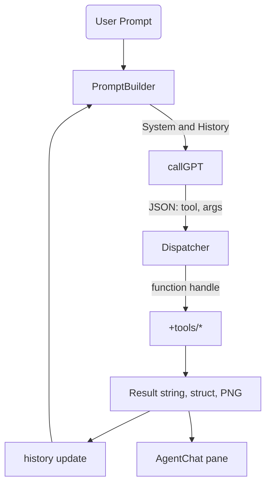

# Orion Agent 

## Description

Orion Agent is an in-process AI companion that converts natural–language requests into MATLAB® scripts and Simulink® models, executes them, inspects results, and iterates—without any GUI-level mouse automation.

It achieves this by exposing a curated set of programmatic "tools" (functions) to a Large-Language Model (LLM). A lightweight ReAct loop stored in memory decides which tool to call next, receives structured feedback (block handles, simulation outputs, error objects), and plans subsequent actions until the user's goal is met.

Build Orion Agent, an in-process AI assistant that lives inside a licensed MATLAB + Simulink session, interprets natural-language tasks through a large-language model (LLM), and executes them programmatically by calling documented MathWorks APIs. Orion never drives the GUI with mouse clicks; it manipulates models through add_block, add_line, set_param, sim, the MATLAB Desktop Editor API, and other stable interfaces.

---

## Project Layout

```
Orion-Agent/
│
├── +agent/                  % core decision loop
│   ├── Agent.m              % ReAct controller; owns chat history
│   ├── ToolBox.m            % registers callable tools
│   └── utils/
│       ├── redactErrors.m   % strips stack traces before LLM sees them
│       └── safeRedactErrors.m  % enhanced error redaction
│
├── +tools/                  % thin wrappers around MATLAB/Simulink APIs
│   ├── +general/
│   │   └── doc_search.m     % find_system / web search of MathWorks help
│   ├── +matlab/
│   │   ├── check_code_lint.m     % checks code for errors and style issues
│   │   ├── commit_git_repo.m     % commits changes to git repository
│   │   ├── get_workspace_var.m   % retrieves value of workspace variable
│   │   ├── open_or_create_file.m % creates or opens a file in editor
│   │   ├── read_file_content.m   % reads contents of a file
│   │   ├── run_code_or_file.m    % evalc wrapper for arbitrary MATLAB code or runs file
│   │   ├── run_unit_tests.m      % executes unit tests
│   │   ├── set_workspace_var.m   % sets value of workspace variable
│   │   └── write_file_contents.m % writes content to a file
│   └── +simulink/
│       ├── auto_layout.m          % Simulink.BlockDiagram.arrangeSystem
│       ├── close_current_model.m  % closes the active Simulink model
│       ├── connect_block_ports.m  % add_line to connect model elements
│       ├── create_new_model.m     % new_system + open_system
│       ├── disconnect_block_ports.m % removes connections between blocks
│       ├── get_block_params.m     % retrieves parameters of blocks
│       ├── insert_library_block.m % add_block wrapper (makes name unique)
│       ├── open_existing_model.m  % opens an existing Simulink model
│       ├── remove_block.m         % removes blocks from model
│       ├── save_current_model.m   % saves the current model
│       ├── set_block_params.m     % sets parameters on blocks
│       └── simulate_model.m       % out = sim(mdl,'ReturnWorkspaceOutputs','on')
│
├── +llm/
│   ├── callGPT.m            % webwrite → OpenAI or local Llama
│   └── promptTemplates.m    % System & few-shot templates
│
├── app/
│   └── AgentAppChat.m          % Enhanced Chat interface for interacting with the agent
│
├── orion_workspace/
│   └── debug_hello.m        % simple test file
│
├── tests/
│   └── t_basic.m            % ensures each tool works on clean MATLAB
│
├── setup_paths.m            % adds necessary directories to MATLAB path
├── launch_agent.m           % script to start the Orion Agent
├── llm_settings.m           % configuration for LLM connection settings
├── README.md                % project overview and documentation
└── set_api_key.bat          % Windows batch file to set API key environment variable
```

---

## UI Implementation Details

The Orion Agent application UI has been completely redesigned with an improved interface that separates the chat interaction from the agent workflow visualization. The new implementation in `app/AgentAppChat.m` replaces the older `AgentChatOld.m` with several key enhancements.

### Backend Logic Implementation

The following key components were added to the AgentAppChat.m file to implement the backend logic:

1. **Properties for Agent Functionality**
   - `Agent`: Reference to the agent.Agent instance
   - `CurrentModelName`: Tracks the active Simulink model
   - `IsProcessing`: Flag to indicate when the agent is busy
   - `TaskTimer`: Timer object for asynchronous processing
   - `CurrentSnapshot`: Stores model snapshot data

2. **Utility Methods**
   - `updateChatHistory()`: Updates the chat history with user/assistant messages
   - `updateWorkflowLog()`: Adds timestamped entries to the workflow log
   - `setAgentStatus()`: Updates status indicators with color-coded feedback
   - `updateModelPreview()`: Captures and displays Simulink model snapshots
   - `processAgentResponse()`: Parses agent responses and updates the UI
   - `base64decode()`: Decodes base64 image data for model snapshots

3. **Event Handlers**
   - `send_user_input_to_llm()`: Processes user input and sends to agent
   - `clear_agent_thought_process()`: Clears the workflow log panel
   - `stopExecution()`: Cancels ongoing agent operations
   - `processAgentRequest()`: Background processing using timer
   - `finishProcessing()`: Cleanup after agent task completion
   - `handleTimerError()`: Error handling for background tasks

4. **Initialization & Cleanup**
   - Constructor initializes agent and sets up welcome message
   - `onAppClose()`: Handles cleanup when app is closed
   - Resource management for timers and open models

### UI Workflow

The implemented backend logic supports the following workflow:

1. User enters text in the input area and clicks "Send"
2. The input is displayed in the chat history and sent to the agent
3. Agent status changes to "Processing" with yellow indicator
4. Agent processes the request in a background timer to keep UI responsive
5. Tool execution is logged in the Agent Workflow panel with timestamps
6. Any model snapshots are displayed in the preview area
7. When complete, status changes to "Ready" with green indicator
8. If errors occur, they're displayed in both chat and workflow logs with red indicator

### Enhanced Features

The implemented backend logic adds several new capabilities:

1. **Asynchronous Processing**: Uses timer objects to keep the UI responsive during long-running operations
2. **Visual Status Feedback**: Color-coded lamp indicator shows agent status (green=ready, yellow=processing, red=error)
3. **Detailed Workflow Logging**: Timestamped logs of all tool executions and operations
4. **Operation Cancellation**: Stop button allows cancelling in-progress operations
5. **Resource Management**: Proper cleanup of resources when operations are stopped or app is closed
6. **Error Visualization**: Clear error indicators in both chat and workflow panels

### Separation of Concerns

The implementation follows a clean separation of concerns:

- **UI Components**: Handled by createComponents() (layout)
- **Agent Logic**: Implemented through the Agent class
- **UI Updates**: Managed by utility methods
- **Event Handling**: Connected to UI buttons through callback functions
- **Resource Management**: Proper initialization and cleanup lifecycle

These enhancements significantly improve the user experience by providing better visibility into the agent's operations and more responsive interaction.

---

## APIs and Capabilities

| Capability | MATLAB/Simulink call | Documentation |
|------------|----------------------|---------------|
| Insert block programmatically | `add_block(source,dest)` → returns handle | [MathWorks Documentation](https://www.mathworks.com/) |
| Connect ports | `add_line(model,src,dst)` | [MathWorks Documentation](https://www.mathworks.com/) |
| Clean diagram layout | `Simulink.BlockDiagram.arrangeSystem(model)` | [MathWorks Documentation](https://www.mathworks.com/) |
| Query / set parameters | `get_param`, `set_param`, Simulink.Mask APIs | [MathWorks Documentation](https://www.mathworks.com/) |
| Add annotations / notes | `add_block('built-in/Note', …)` | [MathWorks Documentation](https://www.mathworks.com/) |
| Discover library paths | `find_system('SearchDepth',0,'Name',query)` | [MathWorks Documentation](https://www.mathworks.com/) |
| Build and run simulation | `sim(model,'ReturnWorkspaceOutputs','on')` | [MATLAB Simulink Documentation](https://www.mathworks.com/) |
| Evaluate free-form code | `evalc(codeStr)` (captured console) | [MATLAB Language Documentation](https://www.mathworks.com/) |

*These documented calls are stable across releases, unlike pixel-level GUI automation.*

### Technology Stack

| Layer | Technology | Purpose |
|-------|------------|---------|
| LLM | GPT-4o (OpenAI REST) or local Llama 3 served over HTTP | Reasoning + code generation |
| MATLAB engine | `matlab.engine` for Python only if the agent is launched outside MATLAB; otherwise call APIs directly | Invokes MATLAB commands, opens/edits models |
| Simulink programmatic API | `add_block`, `add_line`, `Simulink.BlockDiagram.arrangeSystem`, `sim`, `find_system`, `set_param` | Create & mutate diagrams |
| Desktop Editor API | `matlab.desktop.editor.openDocument`, `save`, `insertText` | Open/modify .m, .mlx files programmatically |
| HTTP client | `webwrite`, `webread` | Talk to the LLM endpoint |
| UI | App Designer (`AgentAppChat.m`) | Enhanced chat pane + workflow visualization |
| Tests | `matlab.unittest` | Regression and acceptance criteria |
| Version control | Git | Track code and generated models |

---

## Build Plan (Step-by-Step)

| Step | Action | Outcome |
|------|--------|---------|
| 1 | Clone the repo into a regular MATLAB project (so paths auto-load). | Orion-Agent added to MATLAB path. |
| 2 | Run `setup_paths.m` to ensure all directories are on the MATLAB path. | Required paths are set. |
| 3 | Configure the LLM: run `set_api_key.bat` or manually set your API key. | External reasoning engine reachable. |
| 4 | Unit-test tools: `runtests('tests')`. | Confirms that every wrapper works on your MATLAB version. |
| 5 | Start the agent: run `launch_agent.m`. | Agent instance is created and ready to use. |
| 6 | Interact: use the AgentChat interface to send a request like "Create a model with a Sine Wave feeding a Scope and simulate for 1 s." | Orion Agent executes the necessary tools and provides results. |

---

## Runtime Flow inside Agent.m



- **PromptBuilder** (in promptTemplates.m) merges user text, truncated history, and the tool list.
- **Dispatcher** verifies the requested tool exists in ToolBox; if not, returns an error object for the LLM to reconsider (ReAct pattern).
- **History** keeps alternating Thought → Action → Observation triples, enabling multi-step planning.

---

## Extensibility Hooks

- **Add a new tool**: Drop my_tool.m in the appropriate +tools/ subfolder, add its handle in ToolBox.register().
- **Swap LLM**: Edit llm/callGPT.m. Response must stay JSON-parseable.
- **CI regression**: Integrate tests/ into GitHub Actions using the MathWorks-hosted runner (matlab-actions/run-tests).
- **Vision upgrade**: Inside tools/simulink/auto_layout.m, call createSnapshot and send the PNG to GPT-4o-Vision for spatial feedback.

---

## Safety Guidelines

- Wrap every tool call in try/catch; pipe the MException through utils/redactErrors or safeRedactErrors to avoid leaking file paths.
- Hard-limit model size: e.g., raise a warning if numel(find_system(mdl,'Type','block')) > 1000.
- Use Simulink.BlockDiagram.validate after structural edits to guarantee the diagram compiles before simulation.

