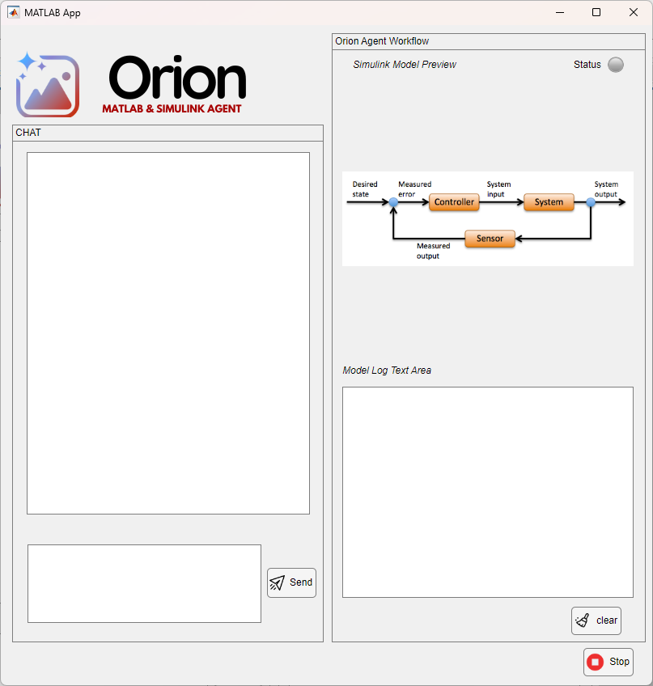
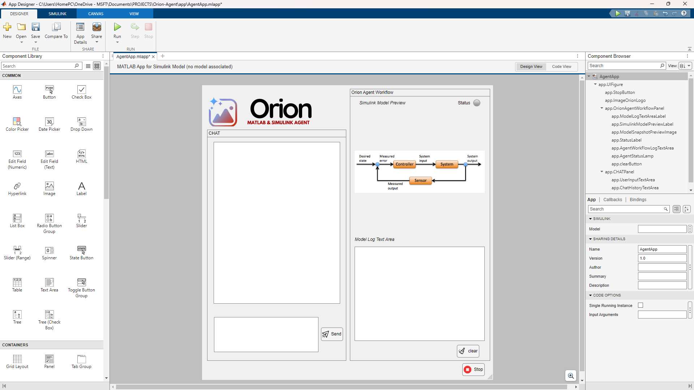

# Orion Agent

Orion Agent is an in-process AI companion that converts natural-language requests into MATLAB® scripts and Simulink® models, executes them, inspects results, and iterates—without any GUI-level mouse automation.

## Overview

Orion Agent uses a curated set of programmatic "tools" (functions) exposed to a Large-Language Model (LLM). A lightweight ReAct loop stored in memory decides which tool to call next, receives structured feedback (block handles, simulation outputs, error objects), and plans subsequent actions until the user's goal is met.

The agent manipulates models through documented MATLAB/Simulink APIs such as `add_block`, `add_line`, `set_param`, `sim`, the MATLAB Desktop Editor API, and other stable interfaces, rather than driving the GUI with mouse clicks.

Here is how the UI looks:

> **Note**: The original App Designer file (.mlapp) has been converted to a standard MATLAB file (.m) for better compatibility. The keyboard shortcuts for sending messages have been removed to address compatibility issues with some MATLAB versions. Use the Send button to submit your requests.
>
> **Note**: The app is designed to be run in a MATLAB session with a licensed version of Simulink.
>
>Below is a screenshot of the app designed in App Designer:


## Project Structure

```
orion-ai-agent-mab/
│
├── +agent/                  % core decision loop
│   ├── Agent.m              % ReAct controller; owns chat history
│   ├── ToolBox.m            % registers callable tools
│   └── utils/
│       ├── redactErrors.m   % strips stack traces before LLM sees them
│       └── safeRedactErrors.m
│
├── +tools/                  % organized tool categories
│   ├── +general/            % general utilities
│   │   └── doc_search.m     % search documentation
│   │
│   ├── +matlab/             % MATLAB-specific tools
│   │   ├── check_code_lint.m
│   │   ├── commit_git_repo.m
│   │   ├── get_workspace_var.m
│   │   ├── open_or_create_file.m
│   │   ├── read_file_content.m
│   │   ├── run_code_or_file.m
│   │   ├── run_unit_tests.m
│   │   ├── set_workspace_var.m
│   │   └── write_file_contents.m
│   │
│   └── +simulink/           % Simulink-specific tools
│       ├── auto_layout.m
│       ├── close_current_model.m
│       ├── connect_block_ports.m
│       ├── create_new_model.m
│       ├── disconnect_block_ports.m
│       ├── get_block_params.m
│       ├── insert_library_block.m
│       ├── open_existing_model.m
│       ├── remove_block.m
│       ├── save_current_model.m
│       ├── set_block_params.m
│       └── simulate_model.m
│
├── +llm/                    % LLM interaction components
│   ├── callGPT.m            % API client for OpenAI, Gemini, or local models
│   └── promptTemplates.m    % System & few-shot templates
│
├── app/
│   └── AgentChat.m          % App Designer UI converted to .m file
│
├── orion_workspace/         % Working directory for agent-generated files
│   ├── debug_hello.m
│   └── hello_count.m
│
└── tests/
    └── t_basic.m            % ensures each tool works on clean MATLAB
```

## Setup and Configuration

1. Clone the repo into a regular MATLAB project (so paths auto-load).
2. Run `setup_paths.m` to ensure all required directories are added to MATLAB's path.
3. Set up your API key using one of the following methods:
   - **Environment variable**: Set `GEMINI_API_KEY` or `OPENAI_API_KEY` as environment variables
   - **Settings file**: Run `llm_settings.m` which will prompt you for your API key and save it securely
   - **Batch file**: Run `set_api_key.bat` on Windows systems to set your environment variables
   
   > **⚠️ SECURITY WARNING**: Never hardcode API keys directly in source code files. Always use environment variables or a settings file that is excluded from version control (.gitignore).

4. Start the application:
   - Run `launch_agent.m` to start the Orion Agent
   - Or open and run `app/AgentChat.m` in MATLAB for the UI interface

> **Note**: The original App Designer file (.mlapp) has been converted to a standard MATLAB file (.m) for better compatibility. The keyboard shortcuts for sending messages have been removed to address compatibility issues with some MATLAB versions. Use the Send button to submit your requests.

## Special Commands

Orion Agent supports special commands that control its behavior:

1. **@agent Continue**: Continues the previous conversation or task
   - Usage: `@agent Continue` - Continues with default continuation prompt
   - Usage: `@agent Continue: <custom prompt>` - Continues with a custom prompt
   
   Example: `@agent Continue: Continue to iterate?` will continue the previous task with additional context

## API Key Security

For secure handling of API keys, follow these best practices:

1. **Environment Variables**: Set API keys as environment variables (most secure method)
   ```
   # Windows
   set GEMINI_API_KEY=your_api_key_here
   
   # macOS/Linux
   export GEMINI_API_KEY=your_api_key_here
   ```

2. **Settings File**: Use the provided `llm_settings.m` script which will:
   - Prompt for your API key
   - Store it in a .mat file that should be added to .gitignore
   - Clear the key from workspace after saving

3. **Never commit API keys**: Ensure .gitignore includes:
   ```
   # API key settings
   llm_settings.mat
   ```

4. **Rotate compromised keys**: If you accidentally commit an API key:
   - Immediately revoke and regenerate the key
   - Clear git history or use git-filter-branch to remove sensitive data
   - Consider using git secrets or pre-commit hooks to prevent future leaks

## Running Tests

Run the included tests to confirm all tools work with your MATLAB configuration:

```matlab
runtests('tests');
```

## Usage Example

In the AgentChat UI, you can type natural language requests like:

For MaTLAB:
> "Create a MATLAB script that says hello world and prints numbers from 1 to 10."
> 
For Simulink:
> "Create a model with a Sine Wave feeding a Scope and simulate for 5 s."

Orion Agent will execute the appropriate sequence of actions:
1. Create a new model
2. Add Sine Wave and Scope blocks
3. Connect them
4. Arrange the layout
5. Run a simulation
6. Show the results and model preview

To continue working on the same task, you can use:

> "@agent Continue: Now add a Gain block between Sine Wave and Scope"

## Response Format

Orion Agent returns responses in a structured JSON format:

```json
{
  "summary": "Brief description of what was accomplished",
  "files": ["file1.m", "model1.slx", ...],
  "snapshot": "data:image/png;base64,...",
  "log": ["tool-call-1", "tool-call-2", ...]
}
```

This format includes:
- A summary of the completed task
- List of files that were created or modified
- A base64-encoded PNG snapshot of any Simulink model
- A log of the tool calls that were executed

## Troubleshooting

If you encounter issues:

1. **App cannot be found**: Make sure you are using the `.m` file version (`app/AgentChat.m`) rather than the `.mlapp` file.

2. **Keyboard shortcuts not working**: Use the Send button instead of keyboard shortcuts. The KeyPressFcn property has been removed for compatibility with various MATLAB versions.

3. **API Key issues**: 
   - Follow the API Key Security guidelines above to properly set up your key
   - Verify the environment variable or settings file is correctly configured
   - Check the MATLAB console for any warnings about missing API keys

4. **Missing dependencies**: Some functionality may require specific MATLAB toolboxes. Ensure you have Simulink and any other required toolboxes installed.

5. **@agent Continue not working**: Make sure the agent has a previous conversation to continue. This command cannot be used as the first interaction.

## Runtime Flow

The ReAct loop in Agent.m follows this pattern:
1. PromptBuilder merges user text, truncated history, and tool list
2. LLM generates a tool call with arguments in JSON format
3. Dispatcher verifies the tool exists in ToolBox
4. The tool is executed and returns a result (string, struct, PNG)
5. Results are added to history and the loop continues until the task is complete

## Extensibility

- Add a new tool: drop a new .m file in the appropriate +tools/ subdirectory and add its handle in ToolBox.register()
- Swap LLM: edit llm/callGPT.m (response must stay JSON-parseable)
- Vision upgrade: Use createSnapshot to send PNG to vision-capable LLMs for spatial feedback

## Safety Guidelines

- All tool calls are wrapped in try/catch with error redaction
- Model size limits can be enforced to prevent resource issues
- Simulink.BlockDiagram.validate ensures model integrity before simulation
- Never hardcode API keys or sensitive information in source code
