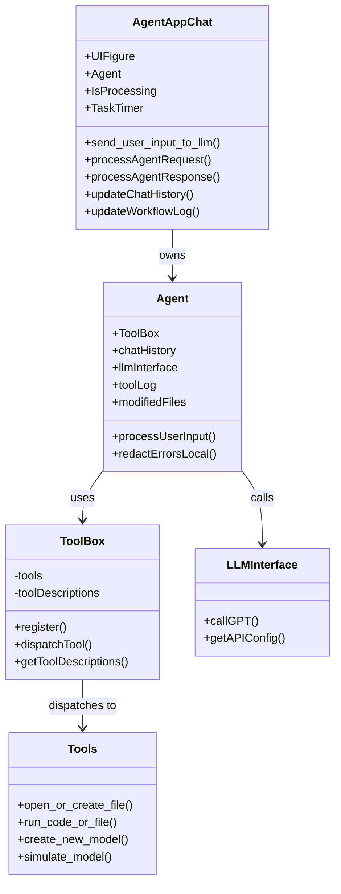
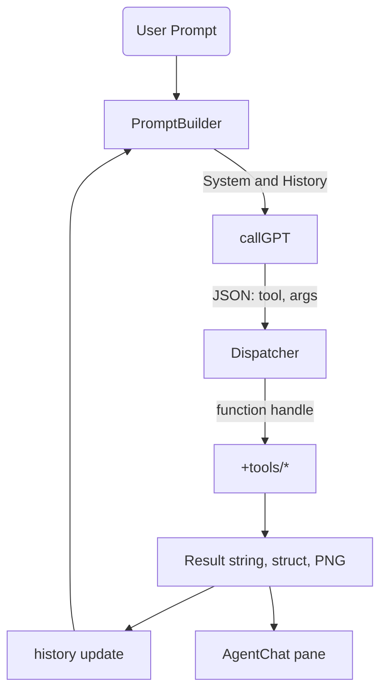
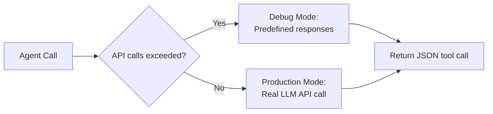

# Architecture

## Core Components and Their Roles

## Runtime Flow inside Agent.m

- **PromptBuilder** (in promptTemplates.m) merges user text, truncated history, and the tool list.
- **Dispatcher** verifies the requested tool exists in ToolBox; if not, returns an error object for the LLM to reconsider (ReAct pattern).
- **History** keeps alternating Thought → Action → Observation triples, enabling multi-step planning.

## Debug Mode vs. Production Mode

In debug mode (default after 3 API calls), the system uses pattern matching on the user query to return appropriate predefined responses, allowing development and testing without API costs.