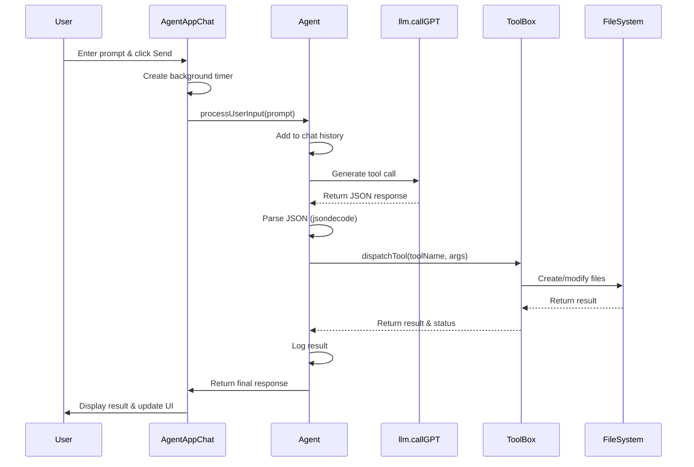
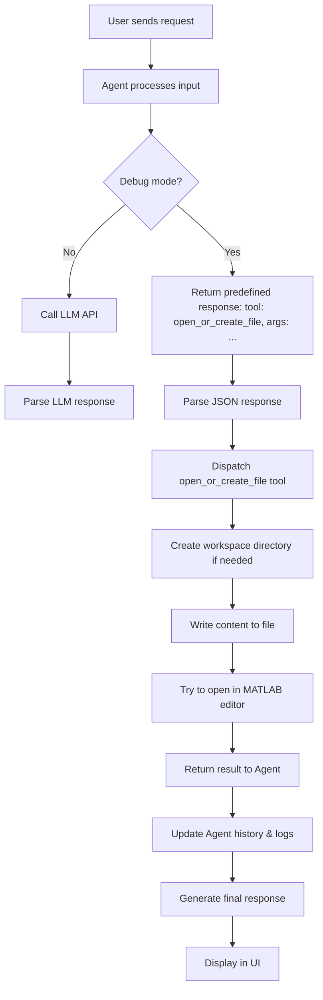
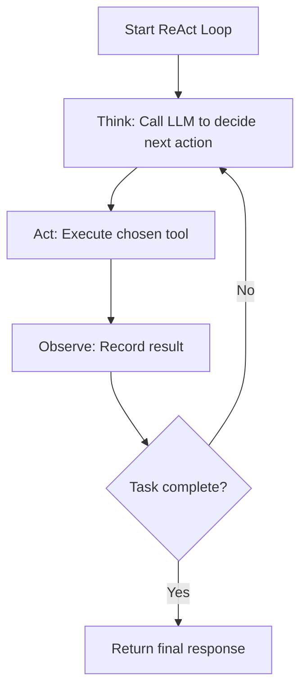

# Detailed Agent Workflow

## Complete Process Flow

When a user enters a prompt like "Create a hello world script that prints 1 to 10", here's the complete workflow that occurs:

## Step-by-Step Execution Flow

1. **Entry Point**: User runs `launch_agent.m` which sets up paths, error handling, and launches the UI
2. **UI Initialization**: `AgentAppChat` creates the interface and initializes the Agent instance
3. **User Input**: User enters prompt and clicks Send button
4. **Processing Setup**: 
   - UI updates with user message
   - Status changes to "Processing"
   - Background timer starts to keep UI responsive
5. **Agent Processing**:
   - Agent adds prompt to chat history
   - Builds LLM prompt with history and available tools
   - Enters ReAct loop (limited to max 3 iterations)
6. **LLM Decision**:
   - Calls `llm.callGPT` to determine next action
   - In debug mode, returns predefined responses based on request pattern
   - In production, calls external API (OpenAI or Gemini)
7. **Tool Execution**:
   - Parses JSON response to get tool name and arguments
   - Records tool call in history and logs
   - Dispatches to appropriate tool via ToolBox
   - For file creation, ensures workspace folder exists
8. **Result Processing**:
   - Tool returns structured result
   - Agent records result in history
   - Tracks modified files
   - Determines if task is complete
9. **Response Generation**:
   - Creates final JSON response with summary, files, log
   - Returns to UI for display
10. **UI Updates**:
    - Parses response
    - Updates chat with summary
    - Shows modified files in workflow log
    - Resets status to "Ready"
    - Cleans up timer resources

## Detailed Tool Flow for File Creation

When creating a file (like our hello world script), this detailed flow occurs:

## ReAct Loop Implementation

The core of Orion Agent is its implementation of the Reasoning-Acting (ReAct) loop pattern:

This pattern allows the agent to:
1. Reason about the best approach to solve a problem
2. Execute appropriate actions using MATLAB/Simulink tools
3. Observe the results and determine next steps
4. Continue until the task is complete or max iterations reached